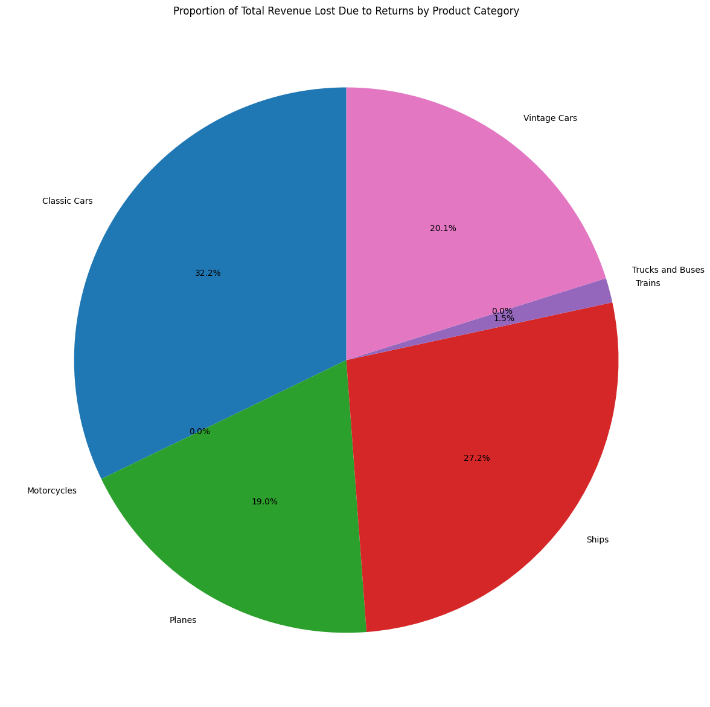

# the Analysis
# 1. what are the Percentage of Quantity Ordered And Sales Made by Each Product Size
In this analysis,I am examining the distribution of sales and quantity ordered across different product sizes (DEALSIZE) using pie charts. The goal is to understand how each product size contributes to the overall sales and quantity sold.
1.Grouping Data:
I first group the cleaned dataset (df_clean) by DEALSIZE to calculate the total sales and total quantity ordered for each product size.
grouped_sales contains the sum of sales for each product size.
grouped_quantity contains the sum of quantities ordered for each product size.
1.Creating Pie Charts:
I create a figure with two subplots to display two pie charts side by side.
The first pie chart visualizes the percentage of total sales contributed by each product size. The autopct parameter formats the percentage display on the chart.
The second pie chart shows the percentage of total quantity sold by each product size.
Visualization:
Each pie chart is labeled with its corresponding product size, providing a clear visual representation of how sales and quantity are distributed among different sizes.
The charts are displayed using plt.show(), which renders them in an organized layout

view my Notebook with detailed steps Here:
[Auto_sales_distribution.ipynb](Auto_sales_distribution.ipynb)

# Visualize Code
```python
df_size
grouped_sales = df_clean.groupby('DEALSIZE')['SALES'].sum()
grouped_quantity=df_clean.groupby('DEALSIZE')['QUANTITYORDERED'].sum()

fig, ax = plt.subplots(1, 2)
fig.set_size_inches((12,5))
# Pie chart for SALES
ax[0].pie(grouped_sales, startangle=90, autopct="%1.2f%%",labels=grouped_sales.index)
ax[0].set_title("Percentage of Total Sales by Each Product size")
# Pie chart for QUANTITYORDERED
ax[1].pie(grouped_quantity, startangle=90, autopct="%1.2f%%",labels=grouped_quantity.index)
ax[1].set_title('Percentage of Quantitty Sold by Each Product Size')
plt.tight_layout()
plt.show()

```

## Result


# Insight
1. Sales Distribution by Product Size:
- Medium size products contribute the most to total sales, making up 60.77% of the sales. This suggests that medium-sized products are the most popular among customers in terms of revenue generation.
- Small size products account for 26.33% of total sales, indicating they are the second-most popular size but still significantly lag behind medium-sized products in terms of revenue.
- Large size products represent only 12.90% of the total sales, which implies that large-sized products are the least popular in terms of sales revenue.
2. Quantity Sold by Product Size:
- When looking at the quantity sold, medium-sized products again dominate with 53.11% of the total quantity sold. This indicates that they are not only leading in sales but are also the most purchased.
- Small-sized products contribute 39.43% of the total quantity sold, suggesting that they are frequently bought, possibly because of lower prices or higher demand for smaller items, but this doesn't translate proportionally into sales.
- Large products make up only 7.46% of the total quantity sold, reaffirming that large products have limited appeal to customers, both in terms of volume and revenue.
3. Comparison Between Sales and Quantity Sold:
- Large-sized products have a disproportionate relationship between quantity sold and sales. While large products account for 7.46% of the quantity sold, they contribute 12.90% to total sales. This suggests that large products are likely priced higher, leading to greater revenue from fewer sales.
- Conversely, small-sized products make up 39.43% of the quantity sold but contribute only 26.33% to sales. This implies that small products are likely priced lower, leading to less revenue despite their high volume.
- Medium-sized products maintain a relatively balanced proportion between their quantity sold (53.11%) and contribution to sales (60.77%), indicating that they have a moderate price point and are popular among customers.
4. Key Takeaways:
- Medium-sized products are the most popular across both dimensions: sales and quantity sold. This balance suggests that they are priced optimally and meet consumer preferences.
- Small-sized products sell in high volumes but bring in relatively lower revenue, likely due to lower price points. There may be room to explore opportunities for increasing the price or bundling small products to enhance revenue.
- Large-sized products contribute significantly to sales despite their low volume, indicating a potential niche market with higher prices. Strategies could include targeting premium customers or finding ways to increase the appeal of large products to a broader audience.

## 2. Whhat are distribution of Sales and Quantity Ordered 
In this analysis, I examine the distributions of sales and quantity ordered using kernel density estimation (KDE) plots. The goal is to visualize how sales and quantities vary across the dataset, providing insights into customer purchasing behavior.
The KDE plots effectively highlight the distribution of sales and quantity ordered, allowing stakeholders to gain insights into customer behavior and preferences. Understanding these distributions can inform inventory management, marketing strategies, and pricing decisions. By analyzing where sales and quantities are concentrated, businesses can better align their offerings with customer demand and optimize their operations accordingly


view my Notebook with detailed steps Here:
[Auto_sales_distribution.ipynb](Auto_sales_distribution.ipynb)

## Visualize code 
```python
#Sales Disbution and qunatiti distribution 
sns.displot(df_clean["SALES"],kind='kde',fill=True, label="Sales Distribution",color="green")
plt.title("Sales Distribution")
sns.displot(df_clean['QUANTITYORDERED'],kind='kde',fill=True,color="Yellow")
plt.title("Quantity Ordered Distribution")
plt.tight_layout()
plt.show()

```
# Result 


# Insight
1. Quantity Ordered Distribution (First Plot):
- The distribution shows a concentrated peak around the 30-40 range for quantity ordered. This indicates that most orders fall within this range, meaning customers tend to order in relatively moderate quantities.
- There is a sharp decline in density after the 40-50 mark, with very few orders exceeding 60 units. This suggests that large bulk orders are rare in the dataset.
- The density curve is highly skewed toward lower quantities, indicating that smaller or moderate orders dominate the dataset.
2. Sales Distribution (Second Plot):
- The sales distribution is highly skewed to the right, with the highest density around the $2,000 to $4,000 range. Most sales transactions are in this range.
- There is a gradual tapering off after $5,000, with fewer transactions contributing to high sales values, and sales exceeding $10,000 are rare.
- The long tail indicates that while high-revenue sales exist, they are infrequent, and the majority of revenue comes from smaller or mid-sized sales.
3. Key Takeaways:
- Both plots indicate a skewed distribution with most transactions concentrated in lower to moderate ranges (for both quantity and sales).
- Large orders and high sales values are rare, while moderate orders are the most frequent, contributing substantially to the overall revenue.
- The analysis could highlight the importance of targeting mid-range buyers who constitute the bulk of the sales volume while considering strategies to engage high-value customers for larger orders and sales.


# 3. What are the Sales Distribution by Product sizes 
- The box plot created using the following code visualizes the distribution of sales across different product sizes (DEALSIZE). This analysis provides insights into how sales vary based on the size of the deals
- The box plot displays the median, quartiles, and potential outliers for sales within each product size category. The length of the boxes indicates the interquartile range (IQR), which reflects the variability in sales. A wider box suggests greater variability in sales amounts among transactions for that product size.
1. Median Sales Comparison:
- The horizontal line inside each box represents the median sales value for each deal size. This allows for easy comparison of central tendencies across different product sizes. For instance, if the median sales for "Large" deals are significantly higher than those for "Small," it indicates that larger deals tend to generate more revenue.
2. Outliers:
- Points outside the whiskers of the box plot represent potential outliers—sales values that are unusually high or low compared to the rest of the data. Identifying these outliers can help in understanding exceptional transactions and may warrant further investigation.
3. Trends by Product Size:
- By examining the distribution for each deal size, stakeholders can identify trends and patterns in sales performance. For example, if "Medium" deals show a higher concentration of high sales values compared to "Small" deals, this could inform marketing strategies or inventory decisions


 The box plot effectively illustrates the sales distribution by product size, allowing stakeholders to compare sales performance across different deal sizes. This analysis is crucial for making data-driven decisions regarding pricing strategies, inventory management, and resource allocation. By understanding how sales vary with product size, businesses can optimize their offerings to better meet customer demand and enhance profitability.

view my Notebook with detailed steps Here:
[Auto_sales_distribution.ipynb](Auto_sales_distribution.ipynb)

## Visualize code
```python
sns.boxplot(data=df_clean,x='SALES',y="DEALSIZE")
plt.title("Sales Distribution by Product Size")
ticks_x=plt.FuncFormatter(lambda y,pos: f'${int(y/1000)}k')
plt.gca().xaxis.set_major_formatter(ticks_x)
```
## Result


## Insight
1. Sales Range and Distribution:

- Small products have a sales range approximately between $1,000 and $3,000, with the majority of sales concentrated around $2,000. The distribution appears tight, with small variability.
- Medium products show a wider spread in sales, ranging from about $3,000 to $7,000. The interquartile range (IQR) is quite broad, indicating variability in sales.
- Large products have a sales range from around $6,000 to over $10,000, with several outliers reaching beyond $12,000 and $14,000. The larger spread and the presence of outliers suggest that there is more variation in sales among large products.
2. Central Tendency:

- The median sales (the line inside the box) increase with product size. Small products' median sales appear around $2,000, Medium products around $5,000, and Large products closer to $8,000.
3. Outliers:

- Large products have several sales outliers exceeding $12,000, suggesting that certain products in this category sell significantly more than others in the same size group. This could indicate premium or highly successful products driving the outliers.
4. Comparison of Variability:

- Small products have the least variability, indicating that their sales are more predictable.
- Medium and Large products show higher variability, with large products exhibiting the most diverse sales patterns.

Recommendations:
- Small products seem to provide consistent, predictable sales. You might focus on maintaining steady production or marketing in this category.
- Medium and Large products, with higher variability, might require further analysis to understand the factors driving higher sales (e.g., seasonal trends, marketing efforts, or customer demand).
- The presence of outliers in large products may be an opportunity to identify specific high-demand items and replicate success with similar products

## 4. What are the Sales and Quantity Ordered By Sales 
The bar plots generated from the provided code visualize the total sales and quantity ordered for each product line. This analysis allows me to compare the performance of different product lines in terms of revenue and volume sold.
The bar plots effectively summarize the sales and quantity ordered by each product line, providing valuable insights into overall performance. This analysis allows businesses to make informed decisions regarding product offerings, pricing strategies, and marketing efforts to enhance profitability and meet customer demand more effectively.

The provided code performs an analysis of total sales and quantity ordered by product line using the dataset. Here's a breakdown of the code and its purpose, followed by insights derived from the analysis.
- The code groups the cleaned dataset (df_clean) by PRODUCTLINE, summing the SALES and QUANTITYORDERED for each product line. The results are sorted in descending order to highlight which product lines generate the most revenue and units sold.
- The total sales DataFrame (df_s) is merged with the total quantity ordered DataFrame (df_q) on the PRODUCTLINE column. This creates a consolidated DataFrame (df_merge) that contains both sales and quantity information for each product line.
- Two bar plots are created: one for total sales and another for quantity ordered by product line. Each bar represents a product line, with annotations showing exact values on the bars for clarity.
- The plots are displayed with appropriate titles to convey what each represents.
view my Notebook with detailed steps Here:
[Auto_sales_distribution.ipynb](Auto_sales_distribution.ipynb)

## Visualize code
```python
df_s = pd.DataFrame(df_clean.groupby('PRODUCTLINE')['SALES'].sum().sort_values(ascending=False))
df_q = pd.DataFrame(df_clean.groupby('PRODUCTLINE')['QUANTITYORDERED'].sum().sort_values(ascending=False))
df_merge = df_s.merge(df_q, on="PRODUCTLINE", how='left')
dic = {'SALES': "Sales By Each Productline", 'QUANTITYORDERED': 'Quantity Ordered By Productline'}
z = ['SALES', "QUANTITYORDERED"]
fig, ax = plt.subplots(2, 1)
fig.set_size_inches((12, 8))

for i, (column, title) in enumerate(dic.items()):
    sns.barplot(data=df_merge, ax=ax[i], x=z[i], y="PRODUCTLINE", palette='dark:salmon_r')
    ax[i].legend().remove()
    ax[i].set_title(title)
    ax[i].set_ylabel('')
    ax[i].set_xlabel('')
    for n, v in enumerate(df_merge[z[i]]):
        ax[i].text(v + 1, n, f'{v:.0f}' + ('$' if column == 'SALES' else ''), va='center')

# Display the plot
fig.suptitle('Sales and Quantity Ordered by Each Productline', fontsize=15)
plt.show()
plt.tight_layout()
```
## Result


## insight
This visualization presents the Sales and Quantity Ordered for different product lines. Here is an insight summary and recommendations based on the charts:

1. Sales by Each Product Line (Top Chart):
- Classic Cars dominate sales with over $3.8 million, far surpassing other product lines.
- Vintage Cars are the second-highest in sales, generating over $1.8 million.
- Trucks and Buses, Motorcycles, and Planes generate similar levels of sales, hovering around $1 million.
- Ships generate around $700k in sales, while Trains show the lowest sales at around $226k.
2. Quantity Ordered by Each Product Line (Bottom Chart):
- The highest quantity ordered is also for Classic Cars, with over 33,000 units sold, which aligns with the high sales figures.
- Vintage Cars have the second-highest quantity ordered at over 20,000 units.
- Motorcycles, Planes, and Trucks and Buses have nearly similar order quantities, ranging between 10,000 and 11,000 units.
- Ships and Trains have significantly lower order quantities, with Ships around 8,000 and Trains being the lowest at just 2,712 units.
2. Key Insights:
- Classic Cars is the top-performing product line in both sales and quantity ordered. This indicates strong demand and profitability for this product line.
- Vintage Cars also show strong performance in both sales and quantity, albeit at lower levels than Classic Cars.
- Motorcycles, Trucks and Buses, and Planes have comparable performance in both sales and quantity. Their sales and order volumes are moderate compared to the leading categories.
- Ships and Trains lag significantly behind the other product lines in both sales and quantity ordered, indicating lower demand or possibly a niche market.
## Recommendations:
- Focus on Classic Cars: Given that Classic Cars are the top performers in both sales and quantity ordered, this product line should be a key focus for continued investment in marketing, production, and inventory management to maintain its leading position.

- Expand the Vintage Cars Market: Vintage Cars are performing well but have potential for further growth. Enhancing promotions or exploring new markets for this product line could drive even higher sales and orders.

- Investigate Niche Products: The lower performance of Ships and Trains may indicate either niche markets or underperformance. Further analysis should be done to understand the underlying reasons. For Trains, consider if this is a product line that should be optimized or if resources should be diverted to higher-performing products.

- Monitor Medium-Performing Product Lines: Motorcycles, Trucks and Buses, and Planes have mid-tier performance. These categories may benefit from targeted marketing efforts or improvements in product offerings to boost sales.

## 6. what are the Top 6  Sales and Quantity ordered Country
I analyzed the total sales and quantity ordered by country, focusing on the top six countries based on sales. This analysis helps to understand the geographical distribution of sales performance and customer demand.
- The code groups the cleaned dataset (df_clean) by COUNTRY, summing the SALES and QUANTITYORDERED for each country. The results are sorted in descending order based on total sales, allowing us to identify the top six countries with the highest sales figures.
- A dictionary (dic) is created to hold titles for the two bar plots: one for sales and one for quantity ordered. A figure with two subplots is initialized to display these metrics.
- For each metric (sales and quantity ordered), a bar plot is created using Seaborn's barplot function. The bars represent the total sales and quantities ordered for the top six countries.
- Legends are removed for clarity, and titles are set according to the dictionary. Additionally, annotations are added to each bar to display the exact values of sales and quantities.

view my Notebook with detailed steps Here:
[Auto_sales_distribution.ipynb](Auto_sales_distribution.ipynb)
## Visualize code
```python
df_c = pd.DataFrame(df_clean.groupby('COUNTRY')[['SALES', 'QUANTITYORDERED']].sum().sort_values(by='SALES', ascending=False))
top_6 = df_c.head(6)
dic = {'SALES': 'Top 6 SALES By Country', 'QUANTITYORDERED': 'Top 6 Quantity Ordered By Country'}
fig, ax = plt.subplots(2, 1)
fig.set_size_inches((12, 8))
for i, (column, title) in enumerate(dic.items()):
    sns.barplot(top_6, x=z[i], ax=ax[i], y="COUNTRY", palette='dark:salmon_r')
    ax[i].legend().remove()
    ax[i].set_title(title)
    ax[i].set_ylabel('')
    ax[i].set_xlabel('')
    for n, v in enumerate(df_merge['SALES']):
        ax[0].text(v + 1, n, f'{v:.0f}$', va='center')
    for n, v in enumerate(df_merge['QUANTITYORDERED']):
        ax[1].text(v + 1, n, f'{v:.0f}', va='center')
fig.suptitle('Sales and Quantity Ordered by Top 6 Countries', fontsize=15)
plt.show()
plt.tight_layout()
 ```  

## Result
   
## insight
this chart visualizes Sales and Quantity Ordered for the top six countries, offering insights into the geographical distribution of demand.

1. Sales by Country (Top Chart):
- USA leads the sales by a significant margin, with over $3.8 million in total sales.
- Spain is the second-largest contributor, generating $1.8 million.
- France follows with just over $1.1 million in sales, closely matched by Australia at $1.1 million.
- UK contributes around $969k, and Italy brings in $700k, showing lower sales compared to the other top-performing countries.
2. Quantity Ordered by Country (Bottom Chart):
- Similar to sales, USA leads in quantity ordered, with over 33,000 units sold.
- Spain also ranks second in terms of quantity ordered, with around 20,000 units, aligning with its sales figure.
- France, Australia, and UK have relatively close numbers, with orders ranging between 10,000 and 11,000 units.
- Italy has the lowest quantity ordered among the top six countries, with just under 8,000 units, corresponding to its lower sales figure.

Key Insights:
- The USA is by far the dominant market, not only in terms of sales revenue but also in terms of quantity ordered, highlighting it as a key focus market.
- Spain consistently ranks second in both sales and quantity, making it a strong market, though considerably behind the USA.
- France, Australia, and UK perform similarly, both in sales and quantities ordered, indicating these are reliable markets with moderate performance.
- Italy shows the lowest sales and quantity ordered among the top six, possibly indicating a smaller or less developed market for your products in that region.
## Recommendations:
- Maintain Strong Focus on the USA: With the USA being the largest contributor to both sales and quantity ordered, continuing efforts in marketing, logistics, and customer engagement in this market is essential for sustaining and growing revenue.

- Targeted Growth in Spain: Spain is the second-largest market in both sales and quantity ordered. There may be potential for further growth with targeted marketing campaigns or expanded product offerings to capture more of the market.

- Analyze France, Australia, and UK: These three markets have similar performance levels, both in sales and quantity. There may be opportunities to increase market share through product differentiation, enhanced distribution, or tailored marketing strategies.

- Expand Efforts in Italy: With Italy showing lower sales and orders, it may be beneficial to investigate the reasons behind the weaker performance. Consider whether more focused marketing efforts, partnerships, or pricing strategies could increase demand in this region.

## 7. What Are Status of the Total Ordered Product
I analyzed the status of total ordered products by aggregating the quantity ordered based on their status. This analysis helps to understand how many products are shipped, canceled, disputed, or in process, providing insights into the overall order fulfillment performance.
- The code groups the cleaned dataset (df_clean) by STATUS, summing the QUANTITYORDERED for each status category. The results are sorted in descending order to highlight which statuses have the highest quantities ordered.
- A bar plot is created using Seaborn's barplot function to visualize the total quantity ordered for each status. The x-axis represents the quantity ordered, while the y-axis represents the different statuses (e.g., Shipped, Canceled).
- Each bar is annotated with its corresponding quantity value for clarity. This makes it easy for viewers to see exact figures directly on the chart.

view my Notebook with detailed steps Here:
[Auto_sales_distribution.ipynb](Auto_sales_distribution.ipynb)

## Visualize code
```python
df_status = pd.DataFrame(df_clean.groupby('STATUS')['QUANTITYORDERED'].sum().sort_values(ascending=False))
fig, ax = plt.subplots(1, 1)
sns.barplot(data=f_status, x='QUANTITYORDERED', y='STATUS', palette='dark:salmon_r')
plt.title('Status of the Total Ordered Product')
for n, v in enumerate(f_status['QUANTITYORDERED']):
    ax.text(v + 1, n, f'{v:.0f}', va='center')

plt.tight_layout()
plt.show()
``` 
## Result


## Insight 
This bar chart displays the distribution of product order statuses, showing the quantity of orders that fall under each status category.

Key Insights:

Shipped Orders:

- The majority of orders, 88,764 units, have been successfully shipped. This is a positive sign that the bulk of your business operations are functioning smoothly, with most products being dispatched to customers as intended.

Cancelled Orders:

- There are 2,038 cancelled orders, which is a relatively small percentage compared to the total shipped. However, cancellations should be monitored closely as they represent lost sales opportunities.

Orders on Hold:

- 1,879 orders are currently on hold. These might represent potential future sales, but they also may indicate issues such as inventory shortages or payment problems that need resolution before fulfillment.
Resolved Orders:

- There are 1,660 resolved orders, likely referring to cases that were previously in dispute or under review but have been successfully addressed.

In Process Orders:

- 1,490 orders are still in process, suggesting they are being prepared for shipment. Monitoring these to ensure timely fulfillment is crucial to maintain customer satisfaction.
 
Disputed Orders:

- 597 orders are in dispute, which could indicate issues related to product quality, delivery problems, or customer dissatisfaction. Although this is a small percentage, disputed orders may represent potential risks to your business reputation if not handled effectively.


## Recommendations:
 
 
Continue Focus on Order Fulfillment:

- The high number of shipped orders is a positive indicator of operational efficiency. Maintaining this level of performance is essential for customer satisfaction and business success.
I
investigate Reasons for Cancellations:

- Although cancellations are not alarmingly high, analyzing the reasons behind them can help identify any patterns (e.g., pricing issues, supply chain delays, or customer dissatisfaction) and improve future performance.

Resolve "On Hold" Orders:

- A considerable number of orders are on hold, potentially due to stock availability or payment issues. Focus on resolving these quickly to either convert them into shipped orders or minimize the number of unresolved holds.

Monitor "In Process" Orders:

- Ensuring that the "In Process" orders are moving efficiently through the supply chain will help minimize delays and keep customers satisfied with timely deliveries.

Address Disputed Orders Proactively:

- Disputed orders, although a small portion, need immediate attention to prevent escalation and to maintain a positive brand image. Focus on improving customer service and resolving any underlying issues, such as product quality or delivery times, to reduce future disputes.

## 8. What are Top 6 Higest customers by Sales and Quantity Ordered
I analyzed the top six customers based on the quantity ordered and sales figures. This analysis helps to identify key customers contributing significantly to the business's revenue and order volume.
- A dictionary (dic) is created to map the metrics (quantity ordered and sales) to their respective titles for the bar plots.
- A figure with two subplots is initialized to display these metrics.
- For each metric (quantity ordered and sales), a bar plot is created using Seaborn's barplot function. The x-axis represents the quantity ordered or sales amount, while the y-axis represents the customer names.
- Legends are removed for clarity, and titles are set according to the dictionary. Annotations are added to each bar to display exact values for better readability.
- The variables x and y are assigned to represent the order quantity (QUANTITYORDERED) and sales (SALES) from the cleaned dataset (df_clean).
- he pearsonr function is called with x and y as arguments. It returns two values:
- correlation: The Pearson correlation coefficient, which measures the strength and direction of a linear relationship between two variables.
- p_value: The p-value associated with the correlation coefficient, indicating the statistical significance of the observed correlation.

view my Notebook with detailed steps Here:
[Auto_sales_distribution.ipynb](Auto_sales_distribution.ipynb)

## Visualize code
```python
dic={'QUANTITYORDERED':'Top 6 customers by Quantity Ordered',
    'SALES': "Top 6 customers by Sales"}
fig,ax=plt.subplots(2,1)
fig.set_size_inches(12,8)
for i,(column,title) in enumerate(dic.items()):
    sns.barplot(data=top6,ax=ax[i],y='CUSTOMERNAME',x=column,palette='dark:salmon_r')
    ax[i].legend().remove()
    ax[i].set_title(title)
    ax[i].set_ylabel('')
    ax[i].set_xlabel('')
    ax[i].legend().remove()
    ax[i].legend().set_visible(False)
    for n,v in enumerate(top6['QUANTITYORDERED']):
        ax[0].text(v + 1,n,f'{v:.0f}',va='center')
    for n,v in enumerate(top6['SALES']):
        ax[1].text(v + 1,n,f'{v:.0f}$',va='center')

from scipy.stats import pearsonr

correlation, p_value = pearsonr(x, y)
print(f'Correlation coefficient: {correlation:.2f}')
print (p_value)

```
## Result 


## insight
This two bar charts representing the top 6 customers by the quantity of orders and total sales (in USD). Here's a summary and recommendation based on the visualized data:

Top Customers by Quantity Ordered:

- Euro Shopping Channel is the top customer with 9,327 units ordered.
- Mini Gifts Distributors Ltd. follows with 6,366 units.
- The other four customers (Australian Collectors, Muscle Machine Inc, La Rochelle Gifts, and Dragon Souveniers Ltd.) ordered between 1,524 and 1,926 units, showing a significant drop-off compared to the top two.

Top Customers by Sales (Revenue):

- Euro Shopping Channel generated the highest sales revenue, at $912,294.
- Mini Gifts Distributors Ltd. also performed well in terms of revenue, with $654,858.
- The remaining four customers contributed sales ranging from $172,990 to $200,995. The gap between the top two and the rest is consistent in both quantity and revenue.

Analysis of the Correlation Results:

Correlation Coefficient: 0.55

- This indicates a moderate positive correlation between Order Quantity and Sales. As the order quantity increases, sales tend to increase as well, but not in a perfect linear fashion. The relationship is somewhat strong but not absolute, meaning other factors could also be influencing sales.

P-value: 3.375473491292281e-220

- The extremely low p-value suggests that this correlation is statistically significant. In other words, there is a very high likelihood that the relationship between order quantity and sales is not due to random chance.

Key Observations:

- Euro Shopping Channel is a dominant customer in both order quantity and sales, significantly outperforming others.
- Mini Gifts Distributors Ltd. also stands out but with a smaller margin compared to Euro Shopping Channel.
- The other customers contribute much less in terms of both orders and sales, indicating a more focused customer base with these top two.
## Recommendations:
- Prioritize Relationships with Euro Shopping Channel and Mini Gifts Distributors Ltd.:

- Strengthen partnerships with these two top customers, as they contribute the largest portions of sales and orders.
- Offer personalized deals, exclusive products, or bulk order incentives to maintain and potentially grow their engagement.

Explore Growth Opportunities with Other Customers:

- Focus on upselling or cross-selling to customers like Australian Collectors, Co. and Muscle Machine Inc. to close the gap between them and the top two customers.
- Conduct further analysis to understand their purchasing behavior and explore targeted marketing strategies.

Diversification of Customer Base:

- Consider strategies to attract new high-volume customers to reduce dependency on the top two accounts.
- Offering incentives, loyalty programs, or tailored marketing campaigns could bring in more customers and boost both orders and sales.

## 9. What it the Relationshi Between Sales and Quantity ordered
I creates a scatter plot to visualize the relationship between order quantity and sales from the dataset. Here’s a detailed explanation of the code and insights derived from the analysis.
- The variables x and y are defined to represent the order quantity (QUANTITYORDERED) and sales (SALES) from the cleaned dataset (df_clean).
- A new figure is created with a specified size (8 by 6 inches).
- The scatter function is used to plot points on a Cartesian plane where:
- The x-axis represents the order quantity.
- The y-axis represents sales.
- Titles and labels are added for clarity.

view my Notebook with detailed steps Here:
[Auto_sales_distribution.ipynb](Auto_sales_distribution.ipynb)

## Visualize code
```python
x = df_clean['QUANTITYORDERED']
y = df_clean['SALES']

plt.figure(figsize=(8, 6))
plt.scatter(x, y)
plt.title('Order Quantity vs sales')
plt.xlabel('Order Quantity')
plt.ylabel('Sales')
plt.show()
```
## Result


## Insight
The scatter plot shows the relationship between Order Quantity (x-axis) and Sales (y-axis). Here's an analysis based on the trend in the plot:

Summary Insights:

- Positive Correlation: There is a clear positive correlation between Order Quantity and Sales. As the number of units ordered increases, the corresponding sales also rise.
- Cluster of Orders: The majority of data points are clustered in the range of 20 to 50 units ordered, with sales typically ranging from $2,000 to $8,000. This suggests that most customers are ordering within this range.
- Outliers: A few points show significantly higher quantities ordered (above 60) and sales exceeding $10,000. These represent larger purchases from a few customers, possibly key accounts or bulk orders.
- Sales Increase with Quantity: For higher order quantities (beyond 60 units), there is a steep increase in sales, indicating that the value per order is higher for these transactions.
## Recommendations:
- Target Bulk Orders: Given the substantial sales associated with larger order quantities, you can create specific marketing strategies to encourage more bulk purchases. Offering discounts or promotions for higher quantities may drive additional revenue.

- Leverage Key Customers: Focus on the outliers with high sales and quantity to ensure their needs are met, and offer personalized services or incentives to maintain and grow their orders.

- Expand Customer Base in the 20-50 Range: Since most orders fall in this range, explore opportunities to increase the order quantity slightly by offering tiered discounts (e.g., buy 40, get a discount on the next 10). This will help push more customers toward higher-order brackets.

- Monitor Outliers: Analyze outliers closely to determine if they represent one-time bulk orders or if there's potential for long-term customer relationships.

- Strengthen the focus on quantity-based sales: Since the correlation is moderate, you can confidently push strategies aimed at increasing order quantities, such as bulk discounts or tiered promotions.

- Further Analysis: Given that the correlation isn't perfect, consider looking at other potential factors affecting sales (e.g., product types, customer demographics) to gain a fuller understanding of what drives higher sales.


    
## 10. What is the Relationshi Between Sales and MSRP
I analyzed the relationship between Manufacturer's Suggested Retail Price (MSRP) and total sales using a scatter plot. 
The dataset (df_clean) is grouped by MSRP, summing the SALES and QUANTITYORDERED for each MSRP value. This aggregation helps in understanding how total sales relate to different MSRP levels.
A scatter plot is created where the x-axis represents MSRP and the y-axis represents total sales. Each point on the plot corresponds to a unique MSRP value and its associated total sales.

- the correlation coefficient between the Manufacturer's Suggested Retail Price (MSRP) and total sales using NumPy's corrcoef function. Here's a breakdown of the code and its significance:
- the np.corrcoef function computes the Pearson correlation coefficient matrix for the two variables: MSRP and total sales.
- The [0, 1] indexing retrieves the correlation coefficient between the two datasets from the resulting matrix.

view my Notebook with detailed steps Here:
[Auto_sales_distribution.ipynb](Auto_sales_distribution.ipynb)

## Visualize Code
```python
grouped_data = df_clean.groupby("MSRP")[['SALES', 'QUANTITYORDERED']].sum().reset_index()
plt.gcf().set_size_inches(12,8)
plt.scatter(grouped_data['MSRP'], grouped_data['SALES'], color='blue')
plt.title('MSRP vs Total Sales')
plt.xlabel('MSRP')
plt.ylabel('Total Sales')
plt.grid()
``` 
```python
correlation = np.corrcoef(grouped_data['MSRP'], grouped_data['SALES'])[0, 1]
print(f'Correlation between MSRP and Total Sales: {correlation:.2f}')
```
## Result


## Key Insight
The scatter plot illustrates the relationship between MSRP (Manufacturer's Suggested Retail Price) on the x-axis and Total Sales on the y-axis. Here are the key insights and recommendations:

Key Insights:

Positive Correlation: There is a general positive correlation between MSRP and Total Sales. As the MSRP increases, total sales tend to increase as well, but the relationship is not strictly linear.

1. Sales Variation Across MSRP Levels:

- For products with MSRP below 100, total sales tend to cluster below $100,000, indicating lower revenue for these lower-priced items.
- For products with MSRP between 100 and 150, there is more variation, with some products generating significant sales (up to $250,000) while others remain lower.
- Products priced above 150 MSRP show higher sales potential, with some reaching beyond $350,000.
- Outliers: There are notable outliers where a few products with higher MSRPs (above 150) have significantly higher total sales. This suggests that certain high-priced products perform exceptionally well in terms of revenue generation.

2. Insights Based on Correlation:

Correlation Coefficient: 0.46
This indicates a moderate positive correlation between MSRP and Total Sales. While higher MSRP values are associated with higher total sales, the relationship is not particularly strong. Other factors beyond MSRP are likely influencing total sales.

## Recommendations:
- Focus on Mid-to-High MSRP Products: Since higher MSRP products (above 100) tend to generate more total sales, consider placing more emphasis on these products in your marketing and sales efforts. Highlight the value these products bring to customers and create targeted promotions around them.

- Strategically Price Products: For products with an MSRP between 75 and 150, which display varying total sales, you might want to analyze individual product performance to understand what drives success in this range. Ensure that products in this category are competitively priced and offer good perceived value to customers.

- Leverage High-End Products: The significant sales associated with higher MSRP products suggest that the market is receptive to premium products. Introduce new high-end items and create campaigns that emphasize the exclusivity or superior quality of these products to capture more of this high-revenue potential.

- Investigate Low MSRP Items: Items with an MSRP below 100 are generating less in total sales. Consider bundling these lower-priced products or pairing them with higher-priced products to drive sales. Alternatively, assess whether the product assortment in this range is serving its purpose or could be optimized further.

- Target Premium Products: Since there is a moderate positive relationship, focus on marketing higher-priced products, as they tend to generate more sales. However, be mindful that not all expensive products will perform well—target those with a track record of success.

- Diversify Sales Strategies: The correlation suggests that price alone is not the only driver of sales. Enhance your strategies by considering other factors such as product quality, brand loyalty, or additional customer benefits (e.g., bundles, warranties).

- Analyze Other Influencing Factors: Conduct further analysis to identify what other factors (besides MSRP) might be contributing to high sales, such as product features, market trends, or customer demographics. This will allow you to refine your approach for each product category.
 
 ## 11. What is the relationship between Manufacturer's Suggested Retail Price (MSRP) and total quantity ordered
The line plot to visualize the relationship between Manufacturer's Suggested Retail Price (MSRP) and total quantity ordered. 
The plt.plot() function is used to create a line plot where:
The x-axis represents MSRP.
The y-axis represents total quantity ordered.
Finally, plt.show() is called to display the line plot

view my Notebook with detailed steps Here:
[Auto_sales_distribution.ipynb](Auto_sales_distribution.ipynb)

## Visualize Code
```python
plt.plot(grouped_data['MSRP'], grouped_data['QUANTITYORDERED'], marker='o', color='orange')
plt.title('MSRP vs Total Quantity Ordered')
plt.xlabel('MSRP')
plt.ylabel('Total Quantity Ordered')

plt.tight_layout()
plt.show()
```
# RESULT


## Key Insight
The plot you shows the relationship between MSRP (Manufacturer's Suggested Retail Price) and Total Quantity Ordered.

1. Insights:

- Peak Points: There are significant spikes in Total Quantity Ordered at certain MSRP values, particularly between 50 and 130. This suggests that customers are more likely to order higher quantities at these price points.

- High Demand Range: The highest concentration of total orders seems to occur between MSRP values of 50 and 130. Outside this range, especially from 150 onwards, the total quantity ordered tends to be lower, which might indicate a drop in demand at higher price points.

- Volatility: The total quantity ordered appears highly volatile even within the high-demand range. Certain MSRPs show large orders, while others have relatively lower orders. This could indicate that other factors, such as product type, seasonality, or promotions, might be influencing the demand.

- Low Quantity Ordered at High MSRP: As the MSRP goes beyond 130, there is a noticeable decrease in the quantity ordered, which could suggest price sensitivity among the customers.

2. Recommendations:
- Target MSRP Range: Focus marketing and sales efforts on products within the MSRP range of 50-130, as this seems to be the sweet spot where demand is highest. Further analysis could narrow this range or identify specific MSRPs where the demand spikes.

- Explore Price Elasticity: Investigate why certain price points within the high-demand range have peaks in orders. You might consider analyzing the types of products at these prices or any external factors (promotions, discounts, or events) that caused the spikes.

- Consider Bundling or Promotions: For products with MSRP above 130, explore bundling them with other items or offering promotions to counteract the drop in demand at higher price points.

* Further Segmentation: Break down the analysis by product category or customer segment to see if specific products or groups show a stronger correlation with MSRP. This could help refine pricing strategies.

## 12.  What is the order Frequancy per Customer
I created a histogram to visualize the distribution  of order frequency per customer using the provided dataset,first calculated the number of orders for each customer. Then,I visualize this information using Seaborn's histplot.
- the sns.histplot() function from the Seaborn library is used to create a histogram. This function visualizes the distribution of a dataset by dividing it into bins and counting how many data points fall into each bin.
- In this case, data=order_freq['Number_of_Orders'] specifies that the histogram will be created using the Number_of_Orders column from the order_freq DataFrame, which contains the number of orders placed by each customer.

view my Notebook with detailed steps Here:
[Auto_sales_distribution.ipynb](Auto_sales_distribution.ipynb)

## Visualize Code
```python
order_freq=order_freq.merge(average_days_between_orders,how='left',on='CUSTOMERNAME')
sns.histplot(data=order_freq['Number_of_Orders'])
plt.title('Histogram of Order Frequency per Customer')
plt.xlabel('Number of Orders')
plt.ylabel('Frequency') 
``` 
# RESULT


# Key Insight 

The histogram shows the distribution of order frequency per customer. Here are some key insights and recommendations based on the visualized data:


1. Majority of Customers Place Few Orders:

- The bulk of the customers place fewer than 50 orders, with the highest frequency around 10 to 30 orders. This suggests that most customers make relatively few purchases.

2. Outliers with High Order Frequency:

- There are a few extreme outliers, notably at around 200 and 250 orders. These represent a very small group of customers who place significantly more orders than the majority.
3. Skewness:

- The distribution is heavily right-skewed, meaning that most customers place a low to moderate number of orders, but there are a few who place a disproportionately large number of orders.
3. Low Engagement Beyond 50 Orders:

- Beyond the 50-order mark, the number of customers drops drastically. The extreme values beyond 100 orders are rare.

## Recommendations:
1. Customer Segmentation:

- Consider segmenting customers based on their order frequency, targeting those with fewer orders for engagement strategies (e.g., personalized offers or promotions to encourage repeat purchases) while nurturing the high-frequency customers with loyalty programs or special incentives.
2. Outlier Analysis:

- Investigate the behavior of outliers who place over 200 orders to understand their needs and identify potential patterns that could be replicated with other customers.
3. Retention Strategy for Low-Order Customers:

- Since a majority of customers are placing fewer than 50 orders, design retention strategies such as re-engagement campaigns, discounts for frequent shoppers, or targeted advertising for customers who have not placed an order in a while.
4. Balance High Order Dependency:

- If the business relies heavily on the small group of high-order customers, consider diversifying the customer base by increasing order frequency among the lower segment to reduce dependency on a few outliers.

## 13. What is the Average days between orders

I created a distribution plot (histogram and Boxplot) to visualize the average days between orders for customers. The distribution plot effectively summarizes customer ordering behavior by illustrating the average days between orders. By understanding how often customers place orders, businesses can refine their marketing strategies, enhance customer engagement, and optimize inventory management to meet demand effectively. This analysis is crucial for improving customer retention and maximizing sales opportunities in a competitive market environment
- The sns.displot() function from the Seaborn library is used to create a distribution plot. This function is particularly useful for visualizing the distribution of a single variable.
- The parameter data=order_freq['Average_Days_Between_Orders'] specifies that the plot will be created using the Average_Days_Between_Orders column from the order_freq DataFrame, which contains the average number of days between orders for each customer.
- The sns.boxplot() function from the Seaborn library is utilized to create a box plot. A box plot is a standardized way of displaying the distribution of data based on a five-number summary: minimum, first quartile (Q1), median, third quartile (Q3), and maximum.
- The input order_freq['Average_Days_Between_Orders'] specifies that the box plot will be created using the Average_Days_Between_Orders column from the order_freq DataFrame, which contains the average number of days that customers wait between their orders.

view my Notebook with detailed steps Here:
[Auto_sales_distribution.ipynb](Auto_sales_distribution.ipynb)

## Visualize code
```python
sns.displot(data=order_freq['Average_Days_Between_Orders'],fill=True, label='Plot of Average Days Between Orders',color="orange")
plt.gcf().set_size_inches(12,8)
plt.title("Plot of Average Days Between Orders")
``` 
```python
sns.boxplot(order_freq['Average_Days_Between_Orders'])
plt.title('Box Plot of Average Days Between Orders')
plt.xlabel('Average Days Between Orders')
plt.tight_layout()
plt.show()
```
## Result 


## Insight

1. Average Days Between Orders:

- The majority of customers have an average order interval between 1400 and 2000 days. Most frequently, the average number of days between orders is around 1600-1800 days.
2. Long Intervals Between Orders:

- A significant portion of customers takes over 1200 days between orders, which is approximately 3-5 years. This indicates low order frequency for many customers.
3. Few Extremely High Gaps:

- There are a small number of customers with average order intervals above 2200 days, extending to around 2400 days. These represent extreme cases where customers take almost 6-7 years to place their next order.
4. Skewness Toward Longer Intervals:

- While the highest frequencies are seen in the 1600-1800 days range, there is a noticeable skew toward larger gaps, suggesting a large customer base with very infrequent purchasing patterns.


Key Insights:
5. Median and Central Tendency:
- The median value, shown by the line within the box, is around 1800 days, meaning that half of the customers take less than 1800 days between orders, while the other half take more.
6. Interquartile Range (IQR):
- The interquartile range (IQR), represented by the box, spans from approximately 1600 to 2000 days. This indicates that 50% of the customers fall within this range of order intervals, between roughly 4.4 to 5.5 years.
7. Potential Outlier:
- There is one notable outlier beyond 2400 days, representing a customer who takes significantly longer than others to place an order (around 6.5 years). This might suggest an anomaly in behavior or a unique customer profile.
8. Symmetry and Spread:
- The plot appears relatively symmetric, suggesting there is no major skew in customer order intervals, though the whiskers extend slightly longer towards the upper end (indicating some customers have long gaps between orders).
9. Range of Days:
- The overall range of days between orders spans from about 1200 days at the lower end to around 2400 days at the upper end, indicating a wide variation in how often customers place orders.
## Recommendations:
1. Re-engagement Strategy:

- Develop strategies to reduce the average days between orders for the majority of customers. This could include automated reminders, promotional offers, or loyalty programs to incentivize more frequent purchases.
2. Target Customers with Long Gaps:

- Specifically target the customers with average order intervals exceeding 2000 days. They might need stronger re-engagement efforts, such as exclusive discounts, personalized offers, or more engaging content to prompt earlier repurchases.
3. Behavioral Analysis:

- Conduct further analysis to understand why customers are taking such long gaps between orders. This could involve examining factors like product lifecycle, customer satisfaction, or changes in customer needs that might explain infrequent orders.
4. Create a Subscription Model or Incentive Plan:

- To encourage customers to purchase more frequently, consider introducing a subscription model (if relevant) or offering time-sensitive incentives such as discounts or rewards that expire after a certain number of days post-purchase.
5. Identify High-Lifetime Value (LTV) Customers:

- Focus on identifying the customers with shorter average intervals (around 1400 days) as potential high-LTV customers. These customers may respond well to retention strategies and could be nurtured to place more frequent orders.
6. Focus on Reducing Time Between Orders:
- Since the median time between orders is around 1800 days (~5 years), the business should implement strategies to reduce this time, such as email reminders or limited-time promotions.
7. Examine the Outlier:
- Investigate the outlier at 2400 days to determine if there are specific reasons for such a long gap. Understanding this customer's behavior could help avoid long intervals for other customers.
8. Segment Customers by Order Frequency:
- Consider segmenting customers based on their order interval, focusing on those with shorter gaps (around 1600 days) and those with longer intervals. Tailored engagement strategies could increase the frequency of orders for both groups.
9. Incentivize Shorter Order Intervals:
- Develop loyalty programs or time-sensitive rewards that encourage customers to place orders before their average gap reaches the higher end of the spectrum (around 2000 days). This could help shift the median to a lower number of days between orders.

## 14.  WHat is the Return rate for each product category
I analyzed the return rates of products based on their order status and visualizes this information using a bar chart.
1. I filtered the dataset to include only orders with a status of "Cancelled." It then groups the data by PRODUCTLINE and counts the number of cancelled orders (ORDERNUMBER) for each product line. The result is stored in a DataFrame called returns_data, which contains the number of returns for each product category.
2. I again grouped the original dataset by PRODUCTLINE but calculated two metrics: the total number of orders (Total_Orders) and the total sales amount (Total_Sales). This information is stored in another DataFrame called total_orders_data.
3. the two DataFrames (total_orders_data and returns_data) are merged on the PRODUCTLINE column using a left join. This ensures that all product lines from total_orders_data are included, even if they have no returns. Any missing values for Number_of_Returns are filled with 0.
4. the return rate for each product line is calculated by dividing the number of returns by the total number of orders. This metric provides insight into how frequently products are returned relative to how many were sold.
5. I estimated the revenue lost due to returns by multiplying the number of returns by the average sales amount per order.
6. Profitability is then calculated as total sales minus revenue lost due to returns, providing a clearer picture of how returns impact overall financial performance.
6. A bar plot is created to visualize the return rate for each product category. The x-axis represents different product lines, while the y-axis shows their corresponding return rates.

wiew my Notebook with detailed steps Here:
[Auto_sales_distribution.ipynb](Auto_sales_distribution.ipynb)

## Visualize code
```python
# Calculate returns data
returns_data = df_clean[df_clean['STATUS'] == 'Cancelled'].groupby('PRODUCTLINE').agg(
    Number_of_Returns=('ORDERNUMBER', 'count')).reset_index()

# Calculate total orders and total sales data
total_orders_data = df_clean.groupby('PRODUCTLINE').agg(
    Total_Orders=('ORDERNUMBER', 'count'),
    Total_Sales=('SALES', 'sum')).reset_index()

# Merge both DataFrames
merged_data = pd.merge(total_orders_data, returns_data, on='PRODUCTLINE', how='left').fillna(0)

# Calculate Return Rate
merged_data['Return_Rate'] = merged_data['Number_of_Returns'] / merged_data['Total_Orders']
merged_data['Revenue_Lost_Due_To_Returns'] = merged_data['Number_of_Returns'] * (merged_data['Total_Sales'] / merged_data['Total_Orders'])
merged_data['Profitability'] = merged_data['Total_Sales'] - merged_data['Revenue_Lost_Due_To_Returns']

# Create a bar plot for Return Rate by Product Category
plt.figure(figsize=(12, 6))
plt.bar(merged_data['PRODUCTLINE'], merged_data['Return_Rate'], color='orange')
plt.title('Return Rate by Product Category')
plt.xlabel('Product Category')
plt.ylabel('Return Rate')
plt.xticks(rotation=45)
plt.grid(axis='y')
plt.show()
```
## Result


## Insight 

- High Return Rate (Ships): The category "Ships" has the highest return rate, close to 8%. This could indicate potential issues in product quality, customer dissatisfaction, or mismatched expectations for this category.

- Moderate Return Rate (Planes, Vintage Cars): "Planes" and "Vintage Cars" have return rates around 4%, indicating that these categories may also face issues like poor fit to customer needs or operational problems.

- Low Return Rate (Classic Cars, Trains): Categories like "Classic Cars" and "Trains" have relatively low return rates, suggesting that customers may generally be satisfied with these products or that they meet expectations better than other categories.

- Unusual Return Trends: Some categories like "Motorcycles" and "Trucks and Buses" have lower return rates, which may imply better product quality or a smaller, more niche customer base with clearer expectations.

## Recommendations:
- Investigate High Return Products: Analyze the "Ships" category to determine why the return rate is so high. You can examine customer feedback or perform quality assessments to identify common issues (e.g., design flaws, wrong product descriptions, or logistic failures).

- Improve Customer Education: For products with moderate return rates like "Planes" and "Vintage Cars," improve product descriptions, instructional materials, or return policies to help customers make better-informed purchase decisions and reduce returns.

- Targeted Customer Support: Provide more post-purchase support for the high-return categories (e.g., warranty services, tutorials, or proactive customer support) to address potential issues before customers decide to return the products.

- Maintain Quality for Low Return Products: For categories with low return rates, ensure the current quality and customer satisfaction levels are maintained.

## What is the Proportion of Total Revenue Lost Due to Returns by Product Category
In this analysis I generated a pie chart to visualize the proportion of total revenue lost due to returns by product category.
- plt.figure(figsize=(12, 12)): This line initializes a new figure for the plot with a specified size of 12 inches by 12 inches, ensuring that the pie chart is large enough for clarity and readability.
- merged_data['Revenue_Lost_Due_To_Returns']: This specifies the data to be plotted, which represents the total revenue lost due to returns for each product category.

wiew my Notebook with detailed steps Here:
[Auto_sales_distribution.ipynb](Auto_sales_distribution.ipynb)

## Visualize code
```python
plt.figure(figsize=(12,12))
plt.pie(merged_data['Revenue_Lost_Due_To_Returns'], labels=merged_data['PRODUCTLINE'], autopct='%1.1f%%', startangle=90)
plt.title('Proportion of Total Revenue Lost Due to Returns by Product Category')

plt.tight_layout()
plt.show()
```
## Result 


## Insight
1. Classic Cars (32.2%): This category accounts for the largest proportion of revenue loss, indicating that returns in this category have a significant financial impact. It may be due to higher product values, frequent returns, or both.

2. Ships (27.2%): Ships are also responsible for a large portion of lost revenue, suggesting potential issues in customer satisfaction, product description mismatches, or defects.

3. Vintage Cars (20.1%): Although Vintage Cars represent a smaller proportion than Classic Cars and Ships, they still account for a substantial portion of revenue loss, highlighting the need for further investigation in this category.

4. Planes (19.0%): Planes also have a notable share of revenue loss, which may indicate logistical challenges or quality issues.

5. Low Revenue Loss (Trains: 1.5%, Trucks and Buses: 0.0%, Motorcycles: 0.0%): These categories contribute very little to the overall revenue loss, implying they have fewer returns, or their returns do not significantly impact revenue.

## Recommendations:
1. Focus on Top Loss Categories: Since Classic Cars, Ships, and Vintage Cars represent over 79% of the revenue loss due to returns, focus efforts on these categories. Investigate why customers are returning these products and address common issues, such as improving product quality, refining descriptions, or offering better customer support.

2. Improve Quality Control and Customer Feedback: For the top revenue loss categories, conduct thorough quality control checks and gather post-purchase feedback. This can help identify common problems and improve customer satisfaction.

3. Product-Specific Return Policies: Consider introducing stricter return policies or extended warranties for Classic Cars and Ships to either prevent returns or reduce the financial burden of returned items.

4. Reduce Returns Through Customer Education: For Vintage Cars and Planes, create better product manuals, online tutorials, or pre-purchase consultations. Ensuring customers are well-informed about the product before purchasing can help reduce returns.

5. Maintain Standards in Low Loss Categories: For categories like Trains, Trucks and Buses, and Motorcycles, ensure that the current quality and satisfaction levels remain high. You may consider optimizing the processes here further to potentially increase sales without additional returns.

### Trend Analysis
## 1. What are the 4 Trending Productline by Sales
I analyzed the Top 4 trending productline by sales and visualizes this information using a line graph,focusing on the sales trends of the top four product lines over time.
The analysis provides valuable insights into sales trends across different product lines, allowing businesses to make informed decisions based on customer behavior and market dynamics. By understanding these trends, companies can refine their marketing strategies, optimize inventory management, and ultimately enhance profitability in a competitive marketplace.
- sns.lineplot(data=df_pivot_trend, dashes=False, palette='tab10'): This line uses Seaborn's lineplot function to create a line plot. The data parameter specifies that the data for the plot will come from df_pivot_trend, which is expected to contain sales data for different product lines over time.
- The dashes=False parameter ensures that the lines are solid instead of dashed, making them easier to read.
- The palette='tab10' parameter specifies a color palette for the lines in the plot.
wiew my Notebook with detailed steps Here:
[trend.analysis.ipynb](trend.analysis.ipynb)

## Visualize code
```python
df_clean.pivot_table(index='Month',columns='PRODUCTLINE',values='SALES', aggfunc='sum')
df_pivot=df_clean.pivot_table(index='Month',columns='PRODUCTLINE',values='SALES', aggfunc='sum')
df_pivot.reset_index(inplace=True)
df_pivot['Month_no']=pd.to_datetime(df_pivot['Month'],format='%B').dt.month
df_pivot.sort_values(by="Month_no",inplace=True)
df_pivot.set_index('Month',inplace=True)
df_pivot.drop(columns="Month_no",inplace=True)
df_pivot_trend=df_pivot.iloc[:,:4]
sns.lineplot(data=df_pivot_trend, dashes=False, palette='tab10')
plt.gcf().set_size_inches(12, 8)
sns.set_theme(style='ticks')
sns.despine()
plt.xlabel("")
plt.ylabel('SALES')
plt.title('Top 4 Trending Productline By Sale', fontsize=15)

for i in range(4):
    plt.text(11, df_pivot_trend.iloc[-1, i], df_pivot_trend.columns[i])
```

## Result


## Insight
Insights:
1.  Classic Cars Dominate Sales:

- Steady performance: Classic Cars consistently maintain high sales throughout the year, showing resilience with some fluctuations.
- November spike: There's a massive sales spike in November, reaching around 800,000 units sold. This may be due to a seasonal event or promotion. The sales drop sharply after December, likely as the event or promotion ends.

2. Motorcycles:

- Motorcycles show modest but relatively stable sales throughout the year, with minor fluctuations.
- There is a noticeable sales increase in October, followed by a slight decline in December. This might indicate an uptick in demand during the holiday season or other factors.

3. Planes and Ships:

- Both Planes and Ships show low but stable sales compared to Classic Cars and Motorcycles.
- Planes have a moderate spike around November, mirroring the trend seen with Classic Cars, indicating that this could be a time when larger, higher-value purchases are more common.

4. Sales Patterns:

- There is a general increase in sales for all product categories around October to November, followed by a sharp decline in December.
- This could indicate a seasonal purchasing trend, possibly linked to holiday shopping or end-of-year promotions.

## Recommendations:
1. Capitalize on the Classic Cars Market:

- Given the high demand, especially in November, consider targeted promotions or bundled deals for Classic Cars during this peak period to further maximize revenue.
- Investigate what causes the November spike (e.g., promotions, holidays) and replicate or amplify these factors throughout the year.
2. Strengthen Motorcycle Marketing:

- With stable sales throughout the year and a minor uptick in October, more marketing efforts could further boost sales in this segment.
- Explore the possibility of targeted promotions during key months like October and November to push Motorcycle sales even higher.

3. Investigate the November Trend:

- Since all product categories experience a spike in sales during November, it's important to understand the underlying reason. Is it a specific holiday, event, or promotional campaign?
- If November's spike is due to a seasonal promotion, consider expanding this campaign across different months to spread out sales and mitigate the December decline.

4. Increase Focus on Planes and Ships:

- Since sales in Planes and Ships are relatively low, consider expanding the product range or improving marketing efforts for these categories.
- You could introduce special financing or leasing options for customers in these categories to make larger purchases more accessible.

5. Post-November Retention:

- The sharp drop in sales in December suggests that November’s spike might be unsustainable. Implement a customer retention strategy to keep momentum high after November. Consider loyalty programs, discounts for repeat purchases, or extended holiday sales into December to sustain the revenue flow.

6. Holiday and Seasonal Marketing:

- The November-December peak hints at a potential holiday trend. Build an aggressive marketing strategy around this time to take full advantage of customer buying patterns.
- Offer exclusive deals, pre-order options, and early access sales to loyal customers before the November rush to spread out sales.
- By focusing on seasonal trends, leveraging successful promotions, and boosting underperforming product lines, you can better optimize sales performance across the year.

## 2. What are the 4 Trending Productline by Quantity Ordered
I analyzed the Top 4 trending productline by QUantity ordered and visualizes this information using a line graph,focusing on the Quantity ordered trends of the top four product lines over time.
The analysis provides valuable insights into Quantity  trends across different product lines, allowing businesses to make informed decisions based on customer behavior and market dynamics. By understanding these trends, companies can refine their marketing strategies, optimize inventory management, and ultimately enhance profitability in a competitive marketplace.
- sns.lineplot(data=df_pivot_trend1[Top4], dashes=False, palette='tab10'): This line creates a line plot using Seaborn's lineplot function. The data parameter specifies that the plot will use data from df_pivot_trend1, filtered for the top four product lines (Top4). The dashes=False argument ensures that solid lines are used instead of dashed lines, which makes them easier to read. The palette='tab10' specifies a color palette for differentiating between the product lines.

wiew my Notebook with detailed steps Here:
[trend.analysis.ipynb](trend.analysis.ipynb)

## Visualize code
```python 
sns.lineplot(data=df_pivot_trend1[Top4],dashes=False,palette='tab10')
plt.gcf().set_size_inches(12,8)
sns.set_theme(style='ticks')
sns.despine()
plt.xlabel("")
plt.ylabel('SALES')
plt.title('Top 4 Trending Productline By Quantity',fontsize=15)
for i in range(4):
    plt.text(11,df_pivot_trend1.iloc[-1,i], df_pivot_trend.columns[i])

``` 

## Result


## Insight 

1. Classic Cars Lead in Quantity:

- Classic Cars have the highest sales quantities across the year, showing a consistent performance.
- Sales peak dramatically in November, exceeding 7,000 units, which indicates a specific demand surge in that month. The reason could be related to holiday sales or major promotional events.
- After November, sales drop sharply in December, similar to the pattern seen in the revenue data.

2. Motorcycles:

- Motorcycles have a steady yet relatively lower sales volume throughout the year, generally remaining between 500 and 1,000 units per month.
- There is a noticeable increase in sales during October and November, followed by a decline in December, which aligns with potential holiday or seasonal shopping trends.

3. Planes and Ships:

- Both categories show a relatively low sales volume, but Planes have a small spike in November, peaking at just over 1,000 units sold.
- Ships remain at a consistently lower sales volume compared to other categories, but show a small upward trend toward the end of the year, coinciding with the overall sales peak in November.

4. November Surge:

- Across all categories, there's a notable surge in sales in November, indicating that this could be tied to a major sales event, holiday, or promotion that drives customer purchasing behavior.

## Recommendations:
1. Maximize Classic Cars Promotions:

- Since Classic Cars are clearly the dominant category in both revenue and quantity, invest heavily in marketing and promotional strategies during the year, especially in the months leading up to November.
- Create exclusive deals or pre-order offers for Classic Cars during November, as this period sees the highest demand.

2. Expand Motorcycle and Planes Campaigns:

- While these categories have relatively lower sales compared to Classic Cars, the increase in quantity during October and November suggests that more aggressive seasonal marketing campaigns could push these product lines further.
- Offer seasonal discounts or bundles for Motorcycles and Planes to capitalize on the sales momentum in these months.

3. Investigate November Peak:

- Understanding why November consistently shows the highest sales (perhaps due to holidays, Black Friday, or other promotions) will allow you to extend or replicate these promotions across other months to balance out sales throughout the year.
- You can introduce pre-sale events in October or offer extended deals into December to maintain the upward sales trend beyond November.

4. Boost Marketing for Lower-Performing Categories:

- With relatively low sales in Ships, explore ways to innovate or diversify this product line to increase its appeal.
- Consider seasonal sales strategies or bundles to encourage customers to buy in higher quantities, especially in October and November when sales naturally rise.

5. Year-Round Promotion Strategy:

- Instead of concentrating all efforts on the November peak, consider spreading sales promotions across the year to smooth out sales spikes and dips. Introduce limited-time offers or flash sales in slower months to keep demand steady.
- Implement a loyalty or subscription program to incentivize repeat purchases and sustain momentum post-November.


